# SSAFY SCHOOL

## 목차

- [프로젝트 소개](#프로젝트-소개)
- [주요 기능](#주요-기능)
- [서비스 아키텍쳐](#서비스-아키텍쳐)
- [개발 환경](#개발-환경)
- [협업 툴](#협업-툴)
- [배포 환경 및 포트 정리](#배포-환경-및-포트-정리)
- [팀 소개](#팀-소개)


## ✅ 프로젝트 소개

광주 캠퍼스를 묘사한 메타버스 플랫폼

- 기획 배경

  - 코로나로 인한 오프라인 강의를 하지 못한 아쉬움
  - 온라인에서도 1년간의 교육활동을 현장감 있게 즐겨보자

- 기대 효과

  - 실제 캠퍼스의 간접 경험

    삼성소프트웨어아카데미(이하 SSAFY) 광주캠퍼스를 묘사하여 실제로 현장에 있는듯한 느낌을 준다.

  - 구성원 간의 친밀감 형성

    화상 채팅 기능을 제공하여 활발한 커뮤니케이션을 통해 SSAFY 구성원들간의 친밀감을 상승 시킨다.


## ✅ 주요 기능

### Web Page

#### Home

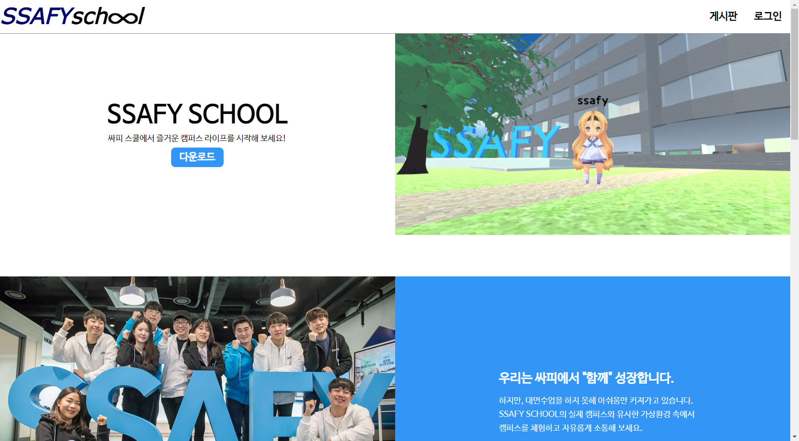

- 메인 페이지
- 다운로드 링크를 통해 SSAFY SCHOOL 파일을 다운로드 받을 수 있다.
  - 로그인 된 사용자만 다운로드 가능

#### My Page


- 보유 마일리지
- 출석 현황
  - 이번달 오늘까지의 출석 현황(지각/조퇴/결석) 확인 가능
  - 예상 수령 금액
  - 잔디밭으로 1년간의 출석 기록 개략적인 확인
- 회원 정보 수정

#### Community

- 게임 공지사항

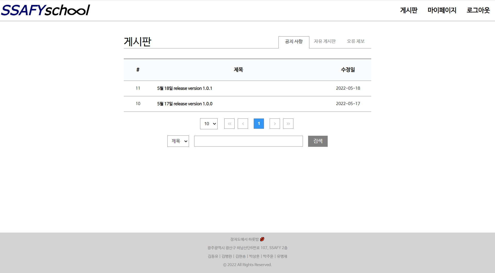

- 자유 게시판

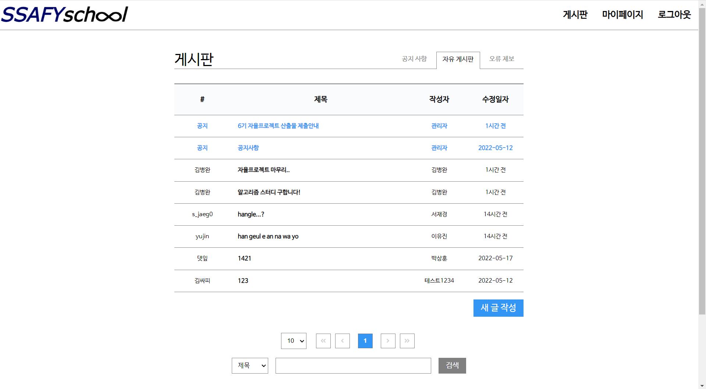

- 오류 제보

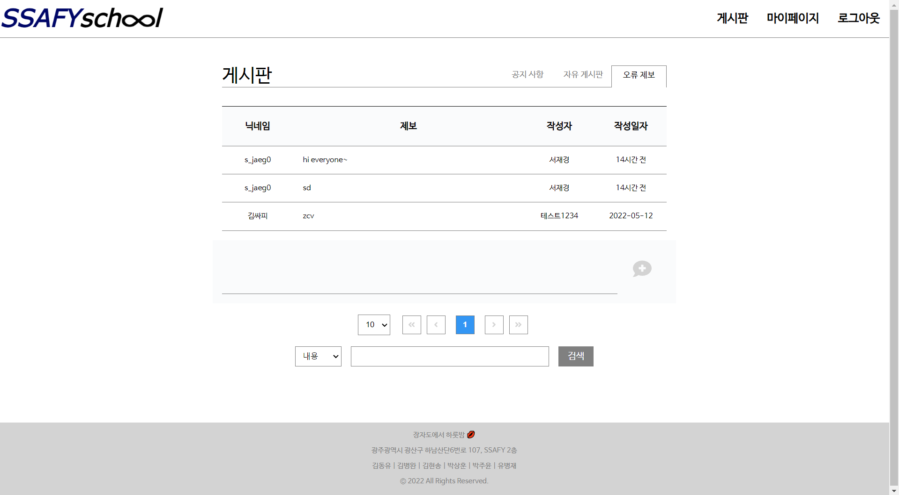

#### Admin


- 유저 정보 수정

### SSAFY SCHOOL

#### UI

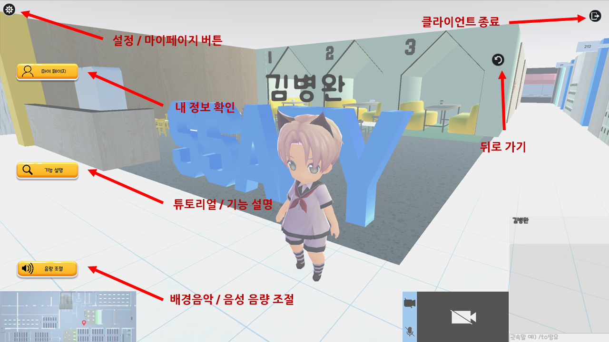

#### Check-IN & OUT

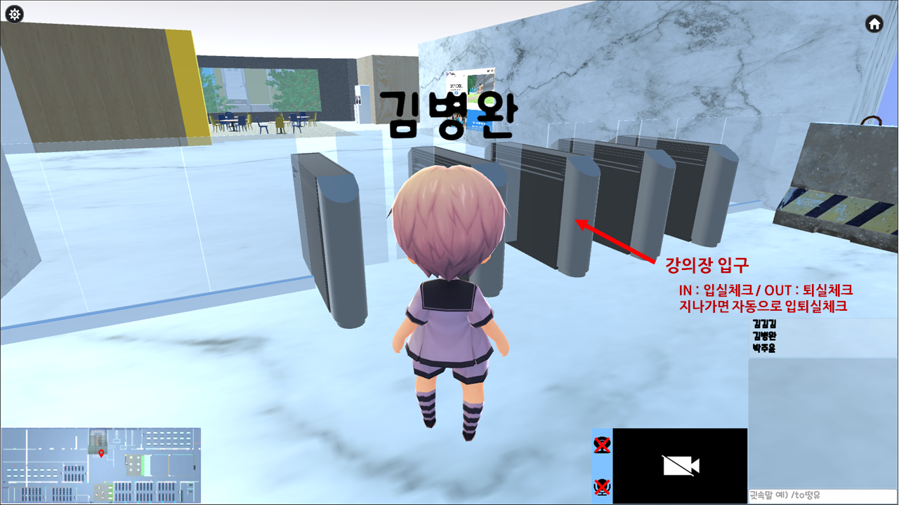

#### ClassRoom


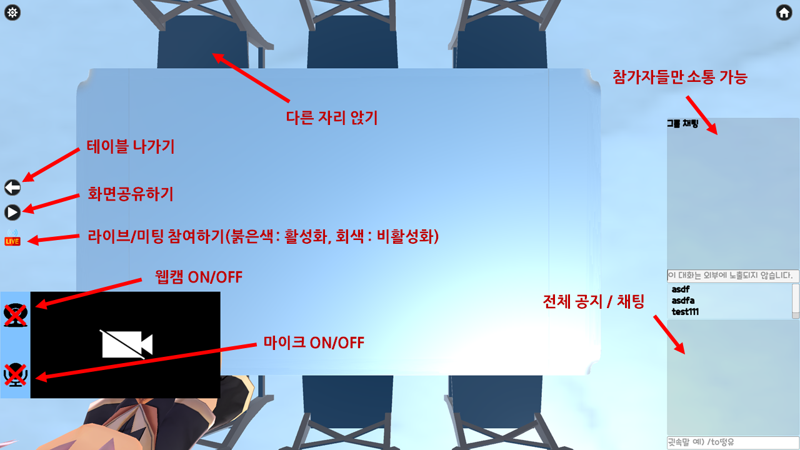

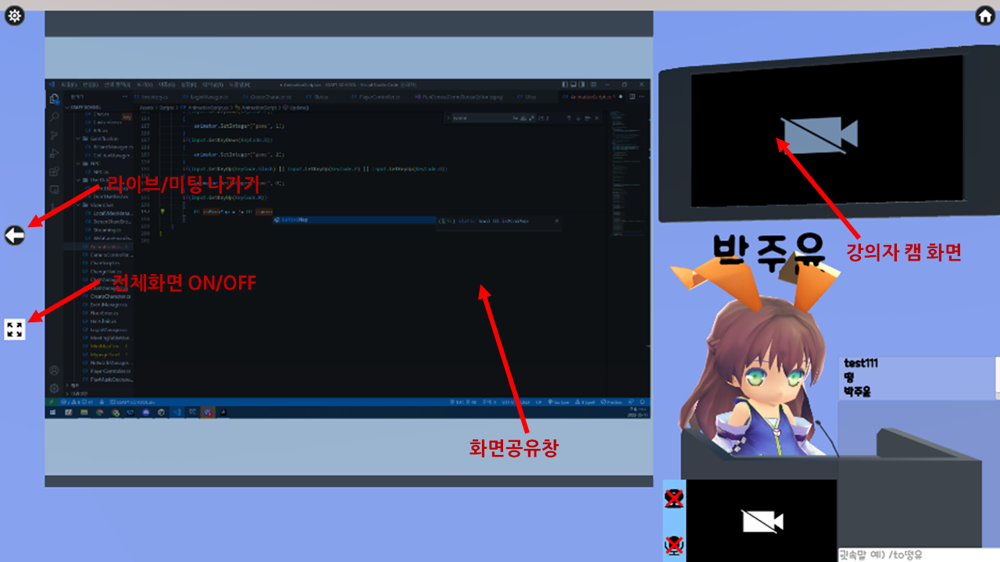

#### Web View


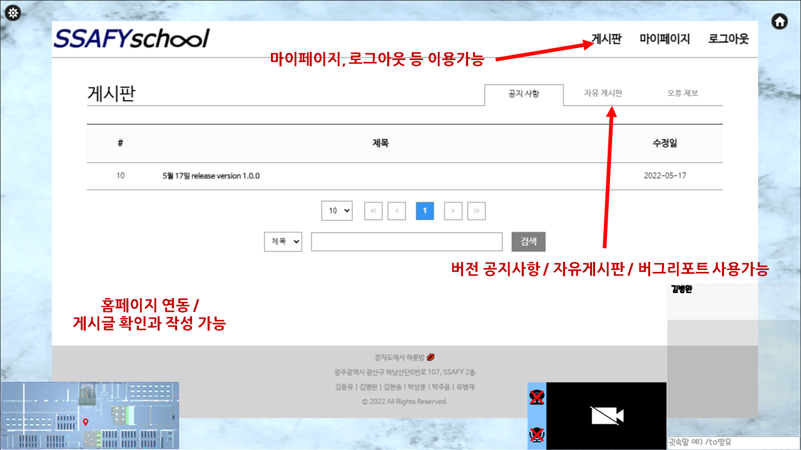

#### Mileage Shop


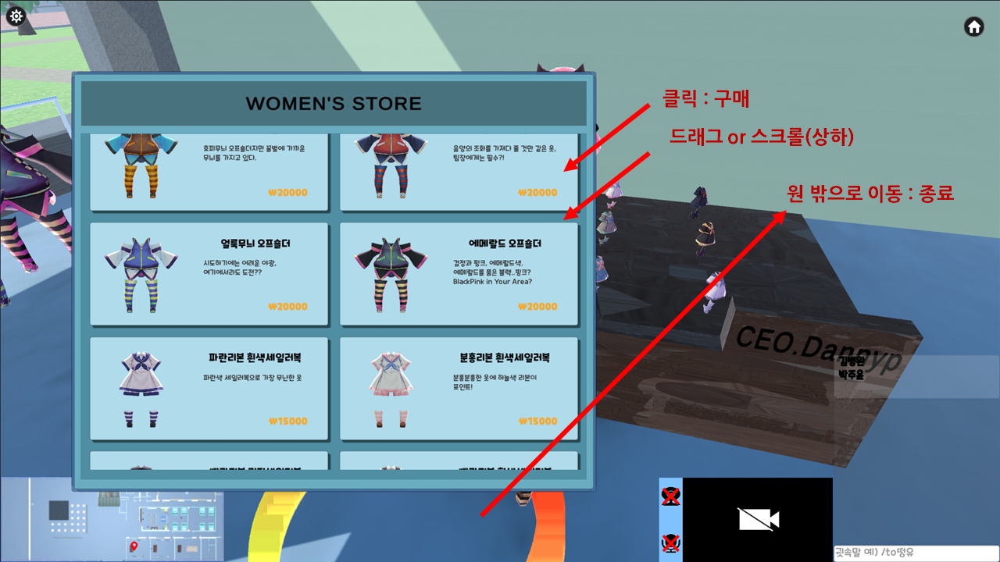


## ✅ 서비스 아키텍쳐

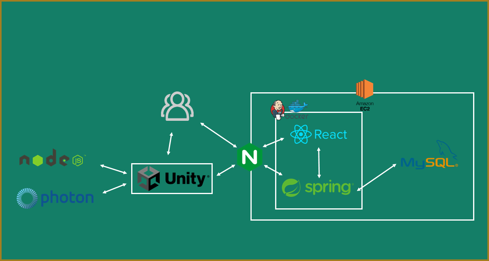


## ✅ ERD

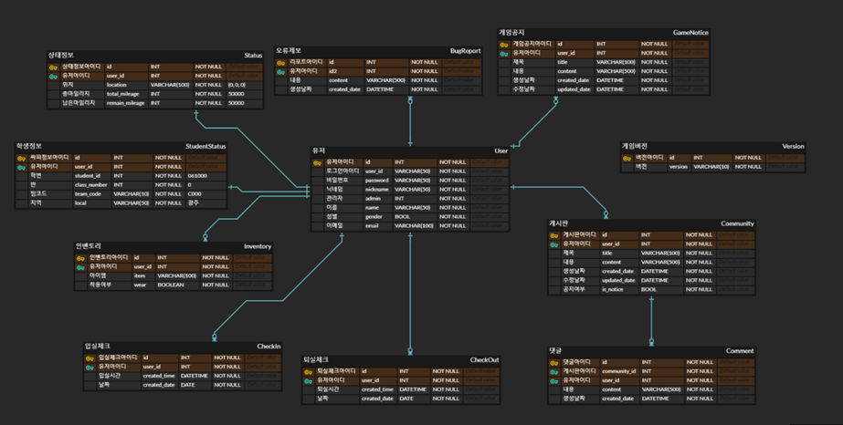


## ✅ 개발 환경

| Backend         | Frontend                      | Game         | CI/CD   |
| --------------- | ----------------------------- | ------------ | ------- |
| IntelliJ        | VS code                       | Unity Hub    | AWS EC2 |
| spring boot     | React 18.0.0                  | Unity Editor | Docker  |
| Spring Security | React-Router-Dom 6.2.2        | Django       | nginx   |
| Java 11         | React-minimal-pie-chart 8.3.0 |              | Jenkins |
| MySQL           | sweetalert2 11.4.10           |              |         |
| Swagger         |                               |              |         |

### Backend

- JWT를 통해 로그인 구현
  - 이메일, 비밀번호 입력받아 로그인을 진행 → 로그인 controller에서는 입력 받은 이메일과 비밀번호가 데이터베이스에 있는 정보와 일치하는지 확인하고 일치한다면 JWT 토큰을 생성해 프론트엔드에 전송→ 프론트엔드에서 JWT를 local storage에 저장 → 프론트엔드에서 백엔드로 API 요청을 보낼 때는header에 JWT를 포함하여 전송
  - JWT 생성 과정: 토큰 제목(subject), 토큰 만료 시간(expriredAt), 토큰 발급자(issuer), 토큰 발급 시간(issuedAt), 사용할 암호화 알고리즘(sign) 등의 정보를 넣어 토큰을 생성

```java
public static String getToken(String userId) {
      Date expires = JwtTokenUtil.getTokenExpiration(expirationTime);
    return JWT.create()
            .withSubject(userId)
            .withExpiresAt(expires)
            .withIssuer(ISSUER)
            .withIssuedAt(Date.from(LocalDateTime.now().atZone(ZoneId.systemDefault()).toInstant()))
            .sign(Algorithm.HMAC512(secretKey.getBytes()));
}
```

- 보안을 위해 유저 패스워드를 암호화 하여 데이터베이스에 저장

  - Password 인코딩 방식에 BCrypt 암호화 방식 사용
  - BCrypt 암호화는 Blowfish 암호를 기반으로 설계된 암호화 함수이며 현재까지 사용중인 가장 강력한 해시 메커니즘 중 하나

- JPA Query문 사용

  - • 좀 더 구체적인 조건 등을 지정하기 위해서 Spring Data JPA는 쿼리 메소드 대신에 @Query(쿼리 어노테이션)을 사용
  - @Query는 실행할 메서드 위에 정적 쿼리를 작성

  ```java
  @Query(value = "SELECT count(id) FROM learn WHERE DATE_FORMAT(created_date,'%m') = ?1 and user_id = ?2", nativeQuery = true)
  int findByMonth(String month, Long pk);
  ```

  - ?1은 첫번째 파라미터를, ?2는 두번째 파라미터를 의미

- Learn-Word-Record 테이블간의 다대일 양방향 연관관계 매핑

  - ManyToOne, OneToMany 어노테이션을 활용
  - OneToMany일 때는 mappedBy 속성에 주인(M) 테이블 작성
  - ManyToOne일 때는 TargetEntity 속성에 연결한 엔티티 지정

### Frontend

- axios로 DB와 데이터 통신
  - api instance를 따로 관리하여 주소가 변하더라도 전체 적용될 수 있도록 제작
  - 이미지와 음성파일을 보낼 때는 multipart/form-data를 활용하여 파일 전송
- react hook 사용하여 동기적 작업 수행
  - useState를 사용하여 컴포넌트 내에서 상태 관리, 컴포넌트 간 상태 관리는 props를 활용
  - useEffect를 통해 컴포넌트가 렌더링 돼었을 때 최초 한 번만 DB로 부터 정보를 받아오고, 두 번째 인자를 활용하여 해당 상태가 변경되었을 때 함수 호출
  - useMemo를 사용하여 의존성이 변경되었을 때만 메모이제이션 값을 다시 계산하여 성능 최적화
- react-router-dom를 사용하여 SSR 수행
  - 최상위 컴포넌트에서 여러 개의 컴포넌트를 단계별로 정의하기 위해 중첩 라우팅을 사용
  - Outlet 라이브러리를 통해 중첩 라우팅의 자식 태그로 기재된 컴포넌트를 불러옴


### 유니티 

- 광주 캠퍼스의 건물 설계도를 바탕으로 실제와 유사한 환경 제작
- 캐릭터 커스터마이징, 인벤토리 기능 구현
- 백엔드(Spring) 서버 통신
  - Client Scene 내에서 로그인 및 입 퇴실체크 기능 (프론트엔드에서 확인 가능)
  - 인벤토리 아이템, 마일리지, 초기 인벤토리 정보 조회, 수정, 아이템 구매 관리
  - 캐릭터 상태정보, 위치정보 저장 및 Client 동기화
  - 사용자 정보 조회를 통해 Client단에서 중복 접속 방지.

- Photon 서버 통신
  - 멀티플레이 기능 제공 ( position, rotation, animation 실시간 동기화 )
  - RPC
  - 채팅 : 전체, 공지, 귓속말 기능 제공
  - 캐릭터 상태 정보(Customized Character) 동기화 

- Node.js(express) Socket.io 통신
  - Scene 내부 미팅룸/강의실 기능 구현 
  - 미팅룸 채팅, 미팅 내부 화상카메라 공유(4인~6인 테이블 단위/ 강의실 단위), 화면(Desktop) 공유, 음성 공유 - 접속 여부 및 공유 내용에 따라 소켓 룸 및 클라이언트 패널 동기화
  - Client 유저 마지막 상태 및 위치정보 동기화

- Unity Asset 


### 배포

- Jenkins CI / CD 구축
  - 배포 자동화를 진행하기 위해 배포 전형 서버인 jenkins 사용
  - Gitlab webhook을 설정하여 Jenkins에 빌드 트리거를 설정했고, 이에 따라 Gitlab에서 master 브랜치에 push하면 자동으로 배포될 수 있도록 구축
  - [ git clone → build → restart ] 하는 작업을 jenkins의 스크립트를 실행하는 작업으로 자동화

- 환경 변수 등록
  - 애플리케이션 내에서 사용되는 URL, SECRET과 같은 정보들은  [application.properties](http://application.properties) 를 통해 환경 변수로 등록


## ✅ 협업 툴

### Git

1. Branch Naming Rule
   - frontend
     - front/{function}
   - backend
     - back/{function}
2. Git commit rule

| FEAT             | 새로운 기능을 추가할 경우                                    |
| ---------------- | ------------------------------------------------------------ |
| FIX              | 버그를 고친 경우                                             |
| DESIGN           | CSS 등 사용자 UI 디자인 변경                                 |
| STYLE            | 코드 포맷 변경, 간단한 수정, 코드 변경이 없는 경우           |
| !BREAKING CHANGE | 커다란 API 변경의 경우                                       |
| !HOTFIX          | 급하게 치명적인 버그를 고쳐야하는 경우                       |
| STYLE            | 코드 포맷 변경, 세미 콜론 누락, 코드 수정이 없는 경우        |
| REFACTOR         | 프로덕션 코드 리팩토링                                       |
| COMMENT          | 필요한 주석 추가 및 변경                                     |
| DOCS             | 문서를 수정한 경우                                           |
| TEST             | 테스트 추가, 테스트 리팩토링(프로덕션 코드 변경 X)           |
| CHORE            | 빌드 태스트 업데이트, 패키지 매니저를 설정하는 경우(프로덕션 코드 변경 X) |
| RENAME           | 파일 혹은 폴더명을 수정하거나 옮기는 작업만인 경우           |
| REMOVE           | 파일을 삭제하는 작업만 수행한 경우                           |

        ex) FEAT : Login 기능 추가

### Jira

1. 이슈 유형
   - 스프린트 :  주차별 스프린터 작성 ex) Week1
   - 에픽 :  주요 기능 ex. Back_로그인, Front_로그인
   - 스토리 :  기능 구현 코드작성 ex) 0304_AM_로그인 폼 작성
   - 테스크 : 문서정리(스토리랑 테스크는 같은 레벨 - ppt나 각자의 readme)
   - 서브테스크 : 스토리, 테스크에서 세부 기능을 나눌 때
2. 규칙
   - 월요일에 예상 스토리, 테스크 작성(최소한 10개 날짜정보+오전/오후 분기해서)
   - [월/일/AM, PM 작업] 형식으로 스토리, 테스크 작성

### Swagger

- Swagger를 통해서 API 문서 자동화
- Swagger URL : [https://k6c202.p.ssafy.io/api/swagger-ui/index.html](https://k6c202.p.ssafy.io/api/swagger-ui/index.html)


## ✅ 배포 환경 및 포트 정리

- **URL** : [https://k6c202.p.ssafy.io](https://k6c202.p.ssafy.io/)

- **배포 여부** : O
- **접속 가능** : 접속 가능
- **HTTPS 적용** : O
- **사용 포트**

| 포트 |                                              |
| ---- | -------------------------------------------- |
| 3000 | React                                        |
| 8080 | Spring                                       |
| 3306 | MySQL                                        |
| 9090 | Jenkins                                      |
| 443  | server default(nginx, https)                 |
| 80   | server default(nginx, http)(redirect to 443) |


## ✅ 팀 소개

| 김병완        | 김동유 | 김현송 | 박상훈   | 박주윤 |
| ------------- | ------ | ------ | -------- | ------ |
| Backend, 팀장 | Unity  | Unity  | Frontend | Unity  |